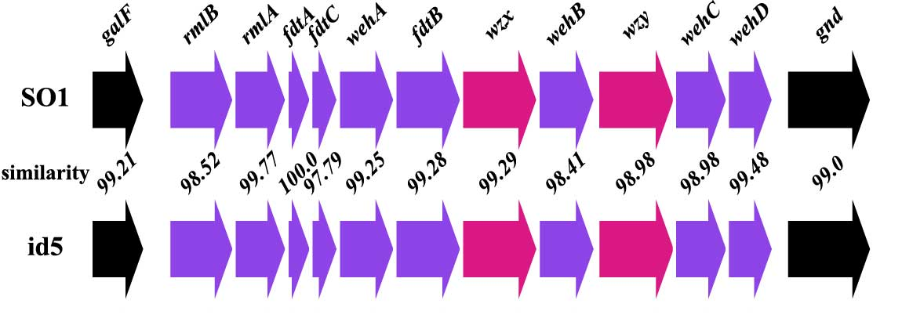
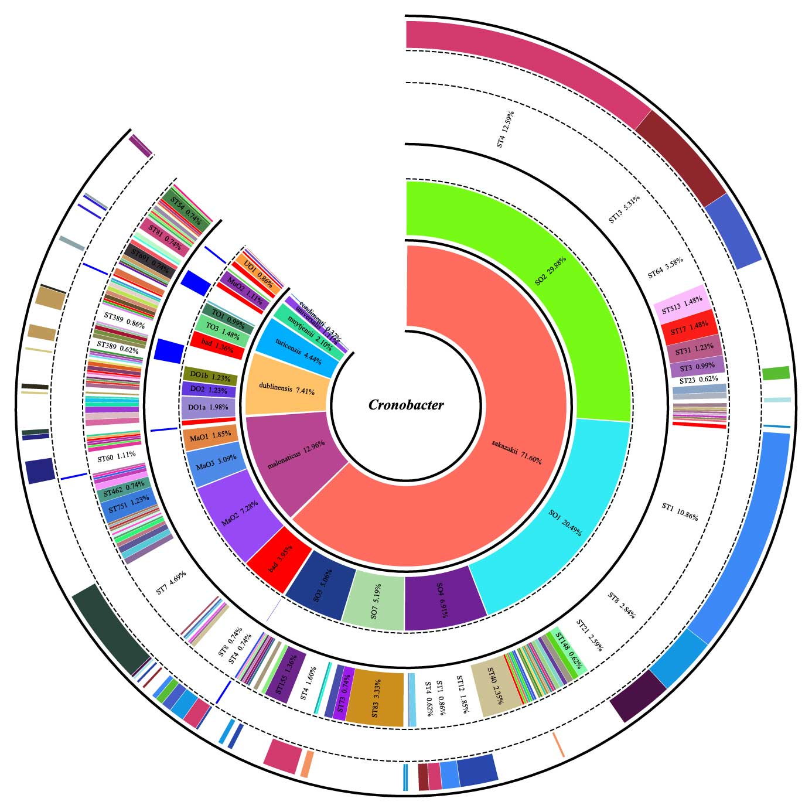

# **CroTrait:** A portable tool for *in silico* species identification, serotyping and multilocus sequence typing of *Cronobacter* genus

## Introduction

This is the homepage of **CroTrait**, a software package that performs efficient inference of species, O serotypes and sequence types (STs) of *Cronobacter*. **CroTrait** was developed by *Lu Wang*. **CroTrait** is called from a directory containing one or multiple genome sequences and each genome sequence should be saved to a separate file in FASTA format. Input files can either be complete genomes or draft genomes. It is able to analyze hundreds of genomes data in a matter of hours on a ordinary PC.   
Moreover, post data analysis and visualization module embedded in **CroTrait** further assist the user in checking and analyzing the data.

## Citation
if you use this software package please cite: 
*Lu Wang, Wenxuan Zhu, Gege Lu, et al*. A portable tool for *in silico* species identification, serotyping and multilocus sequence typing of *Cronobacter* genus.
***Journal of Clinical Microbiology*** 2021 Feb (going to be published)

## Environment set up
**CroTrait** is a program written in **python** and the external software **BLAST+** and **MEGA** need to be installed and configured locally: 

>**[python](https://www.python.org/)** (version 3.8.0)  

>> dependencies  
>> **biopython** (version 1.78 or higher)  
>> **numpy**  
>> **matplotlib**  
>> **pandas**  

>**[MEGA](https://www.megasoftware.net/)** (version X (64-bit)) 

>**[BLAST+](https://blast.ncbi.nlm.nih.gov/)** (version 2.9.0) 

## User guide
>**1. identify species, O serotypes and STs** 
>>**1.1. Assemblies with unknown species** 
>>$***CroTrait -d directory [-p prefix]***  
>>-p: represent the prefix of result file   
>>**1.2. Assemblies with known species (one of the seven species of *Cronobacter*)** 
>>$***CroTrait -d directory -s species [-p prefix]***  

>**2. generate O antigen clusters (O-AGCs) pattern** 
>>$***CroTrait -t 2 -d genomes -s species*** 
>>  example figure  

>**3. extract O-AGCs sequences in batch** 
>>$***CroTrait -t 3 -d directory [-p prefix]***  

>**4. post statistics analysis** 
>>$***CroTrait -t 4 -r result_table***  
>> -r: the result created by "1", namely table with identified species, O serotypes and STs. 
>> after executing this command, 6 table will generated according to the species, O serotypes and ST. 

>**5. post visulization analysis** 
>>  example figure  

## License
**CroTrait** is a free software package, licensed udner **GPLv3**.

## Feedback/Issues
If you need assistance using CroTrait, you can get in touch by emailing Lu Wang (*wlubio@sina.com*), or by asking on Issues page.

